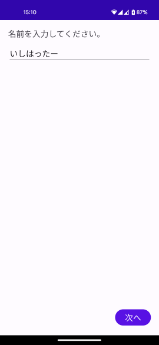
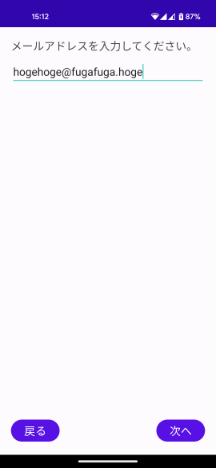
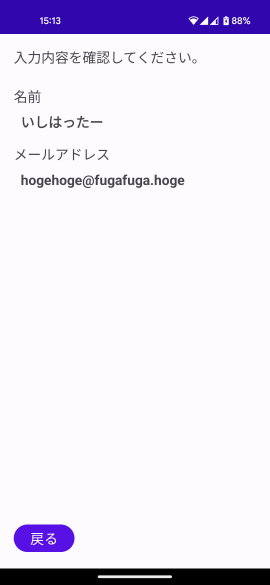
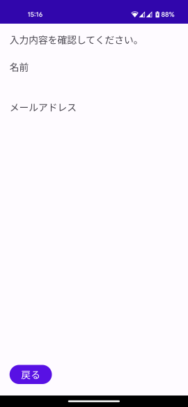

## 概要

これは Android で Singleton を使う際に発生する問題を検証するために作ったプロジェクトです。
意図的にバグを混入させているため扱いには気を付けてください。

## 想定する仕様

このアプリは以下の仕様を想定して作られています。

* 3画面で構成されています。
  * それぞれ画面A, 画面B, 画面Cとします。
* アプリが起動すると画面Aが表示されます。
* 画面Aでは名前を入力し「次へ」ボタンを押すと画面Bに遷移します。
* 画面Bではメールアドレスを入力し「次へ」ボタンを押すと画面Cに遷移します。
* 画面Cではこれまでに入力された名前とメールアドレスが表示されます。

  

## 実装

上記仕様を満たすために以下のように実装しています。

* 各画面はフラグメント（ `AFragment, BFragment, CFragment` ）として実装し、一つのアクティビティ（ `MainActivity` ）内で切り替えて表示する。
* 画面遷移には Navigation コンポーネントを使う。
* **ユーザが入力したデータは Singleton なオブジェクト（ `InputData` ）に保管する。**

## 問題の再現方法

1. アプリを起動する。
2. 適当な名前を入力して「次へ」ボタンをタップする。
3. 適当なメールアドレスを入力して「次へ」ボタンをタップする。
4. 名前とメールアドレスが表示された画面（画面C）でアプリをバックグラウンド状態にし、他のアプリを複数起動したりしてメモリを枯渇させる。
5. 再度このアプリを呼び出すと画面Cが表示されるが **名前とメールアドレスが空欄になっている。**

## 原因

* Android はメモリが枯渇すると長時間使われていないアプリのプロセスを強制終了する。
* その後そのアプリを起動すると新しいプロセスでアプリが立ち上がるがフラグメントの状態（Navigation の状態）は復元される。
  * フラグメントの状態は Android フレームワークが管理しておりプロセスが終了しても維持される。
* 一方で Singleton に保持させたデータは新しいプロセスには引き継がれない。
* その結果フラグメントの状態と Singleton 側の状態に不整合が発生する。
